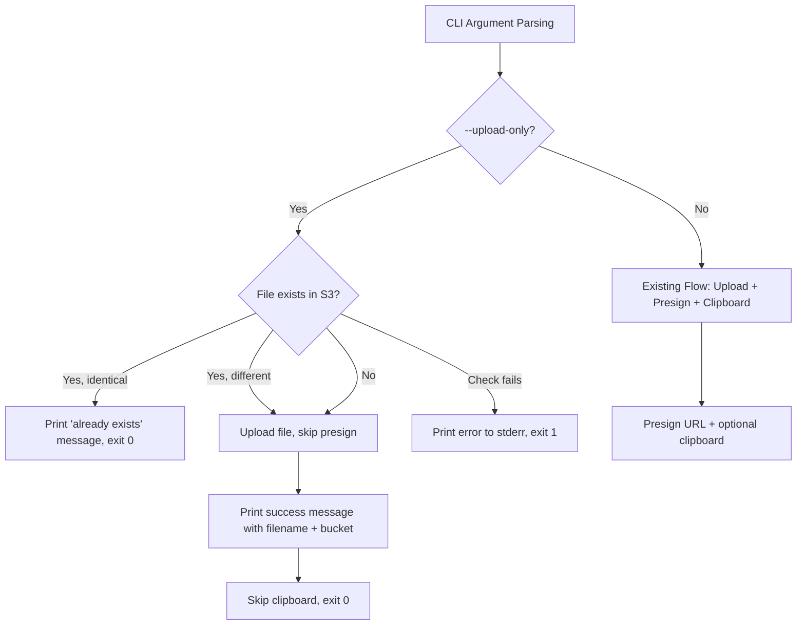
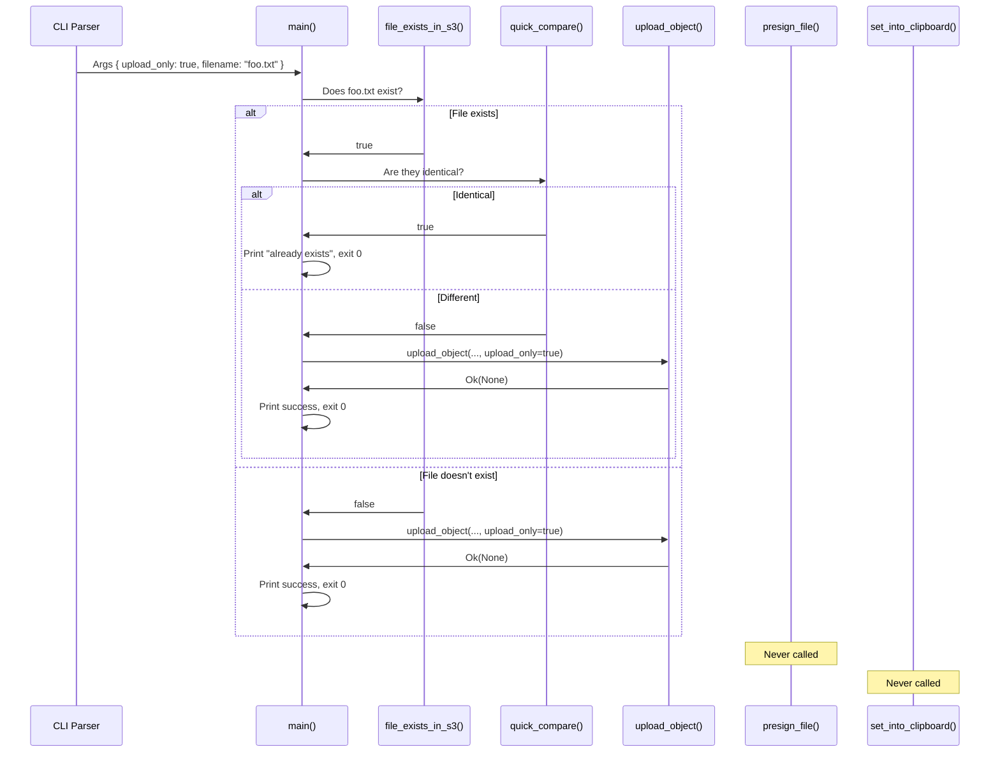

# Design Document: Upload-Only Feature

## Overview

The upload-only feature adds a `--upload-only` CLI flag to Shuk that allows users to upload files to S3 without generating a presigned URL afterward. This addresses use cases where users want to store files in S3 purely for archival or backup purposes, without needing a shareable download link.

The change is minimal in scope: it introduces a new boolean flag to the argument parser, adds a conditional branch in the main upload flow to skip presigning and clipboard operations, and adjusts output messaging to confirm upload-only behavior.

### Design Rationale

- **Minimal surface area**: The existing `upload_object` function already has a `just_presign` parameter that controls whether to upload or only presign. The new feature adds a complementary "upload but don't presign" path, keeping changes localized.
- **No new dependencies**: The feature uses existing clap derive macros and the same S3 client. No new crates are needed.
- **Backward-compatible**: The flag defaults to `false`, so all existing workflows remain unchanged.

## Architecture

The upload-only feature modifies three layers of the existing Shuk architecture:



### Affected Components

1. **CLI Parser** (`src/utils.rs`): Add `upload_only` field to `Args` struct with appropriate clap attributes (`--upload-only`, conflicts with `--init`).
2. **Main Flow** (`src/main.rs`): Add conditional logic after the file-existence check to handle the upload-only path — either skip entirely (file exists and matches), upload without presigning (file doesn't exist or differs), or report error (check fails).
3. **Upload Engine** (`src/upload.rs`): Modify `upload_object` to accept an `upload_only` flag (or introduce a new function/enum) that performs the upload without calling `presign_file` afterward.

## Components and Interfaces

### Modified: `Args` Struct (`src/utils.rs`)

```rust
#[derive(Debug, Parser, Default)]
#[command(version, about, long_about = None)]
pub struct Args {
    #[arg(required_unless_present("init"))]
    pub filename: Option<PathBuf>,
    #[arg(long, conflicts_with("filename"))]
    pub init: bool,
    #[arg(short, long, help = "Enable verbose logging")]
    pub verbose: bool,
    #[arg(long, help = "Upload file without generating a presigned URL", conflicts_with("init"))]
    pub upload_only: bool,
}
```

**Key decisions:**
- `conflicts_with("init")`: The `--upload-only` flag makes no sense with `--init` since init only creates config files.
- `required_unless_present("init")` on `filename` already ensures `--upload-only` without a filename will fail (since `--upload-only` doesn't satisfy the `required_unless_present` condition).
- The field is named `upload_only` which clap auto-maps to `--upload-only` on the CLI.

### Modified: `upload_object` Function (`src/upload.rs`)

The function signature changes to replace the ambiguous `just_presign: bool` with a more descriptive enum, or alternatively, add a new `upload_only: bool` parameter. For minimal changes, we add a new parameter:

```rust
pub async fn upload_object(
    client: &Client,
    file_name: &PathBuf,
    key: &str,
    tags: file_management::ObjectTags,
    just_presign: bool,
    upload_only: bool,
    shuk_config: &utils::Config,
) -> Result<Option<String>, anyhow::Error>
```

**Return type change**: `Result<String, anyhow::Error>` becomes `Result<Option<String>, anyhow::Error>`. When `upload_only` is true, the function returns `Ok(None)` after a successful upload (no URL to return). When `upload_only` is false, it returns `Ok(Some(presigned_url))` as before.

**Logic change**: After the upload section completes (both single-part and multi-part paths), if `upload_only` is true, skip the `presign_file` call and return `Ok(None)` with appropriate stdout messaging.

### Modified: `main` Function (`src/main.rs`)

The main function gains a new code path:

1. If `upload_only` is true and `just_upload` is true (file exists and matches): print "file already exists" message and exit 0 without uploading or presigning.
2. If `upload_only` is true and `just_upload` is false: call `upload_object` with `upload_only=true`, which uploads but skips presign.
3. After `upload_object` returns, if `upload_only` was true, skip all clipboard logic.

### New: Output Messages

| Scenario | Message Format |
|----------|---------------|
| Upload-only, file uploaded successfully | `"========================================\n✅ | File uploaded: {filename}, to S3 Bucket: {bucket_name}\n✅ | No presigned URL generated (upload-only mode)\n========================================"` |
| Upload-only, file already exists | `"========================================\n✅ | File already exists in S3: {filename}\n✅ | No action taken (upload-only mode)\n========================================"` |
| Upload-only, upload failed | stderr: `"Error uploading file: {reason}"` |
| Upload-only, S3 check failed | stderr: `"Error: Could not determine if the file exists - {reason}"` |

## Data Models

### Existing Data Models (Unchanged)

- **`Config`** struct: No changes. The `use_clipboard` field is ignored when `upload_only` is true, but the struct itself is not modified.
- **`ObjectTags`** struct: No changes. Tags are still applied during upload regardless of the upload-only flag.
- **`PartialFileHash`** struct: No changes. Hash comparison still occurs to detect identical files.

### Modified Data Flow



## Correctness Properties

*A property is a characteristic or behavior that should hold true across all valid executions of a system — essentially, a formal statement about what the system should do. Properties serve as the bridge between human-readable specifications and machine-verifiable correctness guarantees.*

### Property 1: Upload-only flag parses correctly with any valid filename

*For any* valid filename string and any combination of compatible flags (`--verbose`), when `--upload-only` is provided alongside the filename, the argument parser SHALL produce a result where `upload_only` is `true`, the filename matches the input, and no error occurs.

**Validates: Requirements 1.2, 1.5**

### Property 2: Existing argument combinations remain valid

*For any* valid argument combination that was accepted before the `--upload-only` flag was introduced (e.g., filename alone, filename + `--verbose`, `--init` alone), the argument parser SHALL continue to accept it and produce the same parsed result with `upload_only` defaulting to `false`.

**Validates: Requirements 6.5**

### Property 3: Clipboard is never invoked in upload-only mode

*For any* `Config` struct (with `use_clipboard` set to `true` or `false`) and any successful upload-only execution, the system SHALL NOT invoke any clipboard utility (pbcopy, xclip, wl-copy, clip.exe).

**Validates: Requirements 4.1, 5.5**

### Property 4: Upload-only success output contains filename and bucket, never a URL

*For any* valid filename and bucket name, when a file is successfully uploaded in upload-only mode, the stdout output SHALL contain both the filename and the bucket name, and SHALL NOT contain any string matching a presigned URL pattern (e.g., containing `X-Amz-Signature` or `https://.*s3.*amazonaws.com`).

**Validates: Requirements 5.1, 5.2**

### Property 5: Already-exists output in upload-only mode contains filename

*For any* valid filename where the S3 identity check determines the file is identical, the stdout output in upload-only mode SHALL contain the filename and indicate that no action was taken, and SHALL NOT contain a presigned URL or URL-related messaging.

**Validates: Requirements 3.2**

## Error Handling

| Error Scenario | Behavior | Exit Code |
|---|---|---|
| `--upload-only` without filename | clap prints error to stderr: "required argument not provided" | Non-zero (clap default) |
| `--upload-only` with `--init` | clap prints conflict error to stderr | Non-zero (clap default) |
| S3 existence check fails (network/permissions) | Print error to stderr with reason, do NOT attempt upload | 1 |
| Upload fails (network/permissions/S3 error) | Print error to stderr with reason | 1 |
| Config file missing/invalid | Existing behavior: print error, exit 1 | 1 |
| File not found locally | Existing behavior: "Failed to open file" error | 1 |

### Error Propagation Strategy

- **CLI parsing errors**: Handled entirely by clap. The `conflicts_with` and `required_unless_present` attributes ensure invalid combinations are rejected before any business logic runs.
- **S3 errors in upload-only mode**: When `--upload-only` is set and the S3 identity check fails, the tool should exit early with an error rather than proceeding with a potentially duplicate upload (per Requirement 3.4).
- **Upload errors in upload-only mode**: Same as existing behavior — propagate the error, print to stderr, exit 1.

## Testing Strategy

### Unit Tests

Unit tests focus on the argument parsing layer where we can test the `Args` struct directly:

1. **`--upload-only` with filename parses correctly** — verify `upload_only` is `true` and filename is set.
2. **`--upload-only` without filename fails** — verify clap returns an error.
3. **`--upload-only` with `--init` fails** — verify clap returns a conflict error.
4. **`--upload-only` with `--verbose` and filename succeeds** — verify all three fields are correct.
5. **Default behavior without `--upload-only`** — verify `upload_only` defaults to `false`.
6. **Existing flag combinations still work** — verify `--init`, `--verbose`, filename alone all work as before.

### Property-Based Tests

Property-based tests verify universal correctness properties using randomized inputs:

- **Library**: `proptest` (Rust property-based testing crate, already compatible with the project's Rust edition)
- **Minimum iterations**: 100 per property test
- **Tag format**: `// Feature: upload-only, Property {N}: {description}`

Properties to test:
1. **CLI parsing property** (Property 1): Generate random valid filenames, verify --upload-only parses correctly.
2. **Backward compatibility property** (Property 2): Generate random valid existing argument combinations, verify they still parse with upload_only=false.
3. **Output format property** (Property 4): Generate random filename/bucket pairs, verify success message format.
4. **Already-exists output property** (Property 5): Generate random filenames, verify the "already exists" message contains the filename.

### Integration Tests

Integration tests verify the full flow with mocked S3:

1. **Upload-only, new file**: Mock S3 to report file doesn't exist, mock upload to succeed, verify no presign call and correct output.
2. **Upload-only, identical file**: Mock S3 to report file exists with matching hashes, verify no upload and no presign.
3. **Upload-only, different file**: Mock S3 to report file exists with different hashes, mock upload to succeed, verify upload occurs but no presign.
4. **Upload-only, S3 check failure**: Mock S3 check to fail, verify error message and non-zero exit.
5. **Upload-only, upload failure**: Mock upload to fail, verify error message and non-zero exit.
6. **Default mode (backward compat)**: Mock S3, verify presign URL is generated and clipboard is invoked when configured.
7. **Clipboard suppression**: Run with upload_only=true and use_clipboard=true in config, verify clipboard is never invoked.
